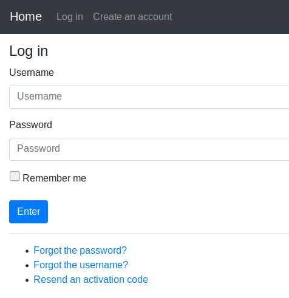
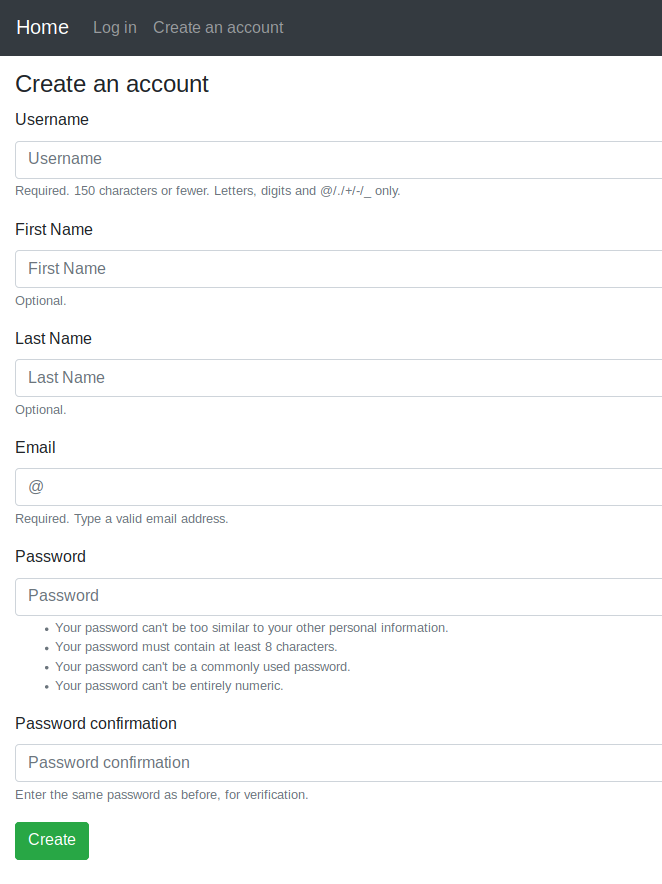
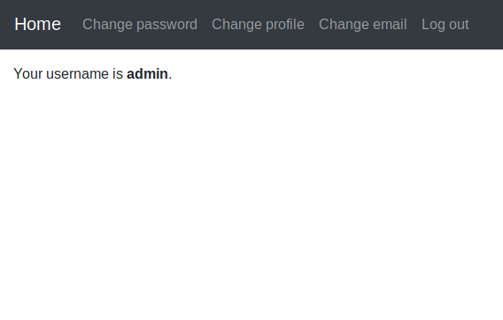
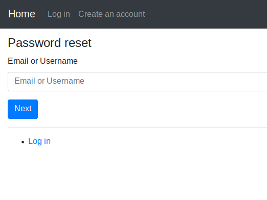
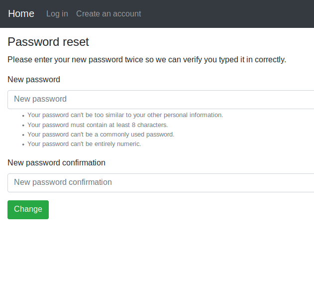
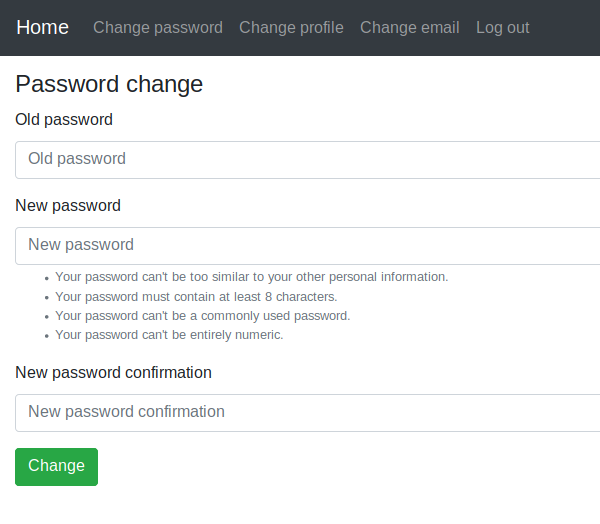

# Simple Django Login and Registration - Team Project

[](https://github.com/egorsmkv/simple-django-login-and-register/actions/workflows/ci.yml)

This project is a **team-based implementation** of a Django authentication system.  
It demonstrates how to build and organize a full user authentication system using Django, Git, and collaborative development workflows.

---

## 📌 Project Overview

This Django web application provides a complete authentication system with the following features:

- User Registration
- Login / Logout system
- Email-based authentication
- Password reset functionality
- Password change feature
- Profile management
- Account activation via email
- Username reminder system
- Resend activation code
- Multi-language support (English, French, Chinese, Spanish)

---

## 🖼️ Screenshots

| Log In | Create Account | Authorized Page |
|--------|----------------|-----------------|
|  |  |  |

| Password Reset | Set New Password | Change Password |
|----------------|------------------|-----------------|
|  |  |  |

---

## ⚙️ Features

### 🔐 Authentication System
- Login using username & password
- Login using email & password
- Login using email or username
- Optional "Remember Me" feature

### 👤 User Management
- Create account
- Logout
- Profile activation via email

### 🔒 Security Features
- Password reset system
- Change password
- Email verification system

### 📩 Additional Features
- Username reminder
- Resend activation email
- Change email
- Update profile information

### 🌍 Internationalization
- English
- French
- Simplified Chinese
- Spanish

---

## 👥 Team Contribution

This project was developed collaboratively using **Git & GitHub workflows**.

- Each member worked on a separate branch
- Features were developed independently
- Pull Requests were used for merging into the main branch
- Main branch always contains stable production code

---

## 🛠️ Tech Stack

- Python 3
- Django Framework
- SQLite Database
- HTML / CSS
- Bootstrap (if used)

---

## 🚀 How to Run the Project (Step by Step)

Follow these steps carefully to run the project locally:

---

### 1️⃣ Clone the repository

```bash
git clone https://github.com/MaiMagdyZaghloul/team-project.git
cd team-project